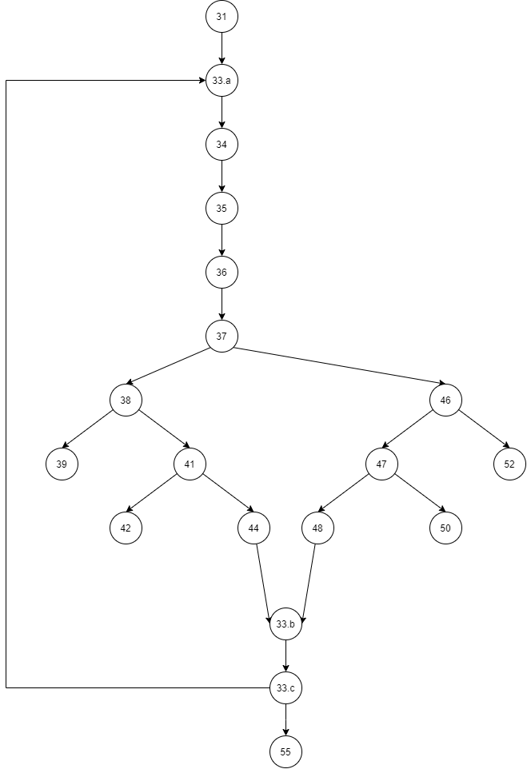

# Втора лабораториска вежба по Софтверско инженерство

## Елисавета Тимова, бр. на индекс 171022

### Група на код:

Ја добив групата на код 6

###  Control Flow Graph

Фотографија од control flow graph-ot
#### Напомена: Секој јазол ни означува број на линија во функцијата.

### Тест случаи според критериумот Every path
#### Според Every path критериумот, ги добивме следниве тест случаеви следејќи ги патеките од добиениот граф на гранење.
TC1: 31, 33.a, 34, 35, 36, 37, 38, 39
TC2: 31, 33.a, 34, 35, 36, 37, 38, 41, 42
TC3: 31, 33.a, 34, 35, 36, 37, 38, 41, 44, 33.b, 33.c, 33.a
TC4: 31, 33.a, 34, 35, 36, 37, 38, 41, 44, 33.b, 33.c, 55
TC5: 31, 33.a, 34, 35, 36, 37, 46, 52
TC6: 31, 33.a, 34, 35, 36, 37, 46, 47, 50
TC7: 31, 33.a, 34, 35, 36, 37, 46, 47, 48, 33.b, 33.c, 33.a
TC8: 31, 33.a, 34, 35, 36, 37, 46, 47, 48, 33.b, 33.c, 55

### Тест случаи според критериумот Every branch
#### Според Every branch критериумот, ги добивме следниве тест случаеви следејќи ги патеките од добиениот граф на гранење.
TC1  (37->38): 31, 33.a, 34, 35, 36, 37, 38
TC2  (37->46): 31, 33.a, 34, 35, 36, 37, 46
TC3  (38->39): 31, 33.a, 34, 35, 36, 37, 38, 39
TC4  (38->41): 31, 33.a, 34, 35, 36, 37, 38, 41
TC5  (41->42): 31, 33.a, 34, 35, 36, 37, 38, 41, 42
TC6  (41->44): 31, 33.a, 34, 35, 36, 37, 38, 41, 44
TC7  (41->44): 31, 33.a, 34, 35, 36, 37, 38, 41, 44
TC8  (46->47): 31, 33.a, 34, 35, 36, 37, 46, 47
TC9  (46->52): 31, 33.a, 34, 35, 36, 37, 46, 52
TC10 (47->48): 31, 33.a, 34, 35, 36, 37, 46, 47, 48
TC11 (47->50): 31, 33.a, 34, 35, 36, 37, 46, 47, 50
TC12 (33.c->33.a): 31, 33.a, 34, 35, 36, 37, 38, 41, 44, 33.b, 33.c, 33.a
TC13 (33.c->55): 31, 33.a, 34, 35, 36, 37, 38, 41, 44, 33.b, 33.c, 55

### Објаснување на напишаните unit tests
#### Тест Случај 1: Го опшива TC8 од Every Path критериумот.
За дадена листа агли со еден валиден агол, функцијата ќе го претвори аголот од формат степен, минути, секунди во секунди.

#### Тест Случај 2: Го опшива TC7 од Every Path критериумот.
За дадена листа агли со повеќе валидни агли, функцијата ќе ги претвори аглите од формат степен, минути, секунди во секунди.

#### Тест Случај 3: Го опшива TC9 од Every Branch критериумот.
За дадена листа агли со агол со невалиден степен, функцијата ќе фрли исклучок.

#### Тест Случај 4: Го опшива TC3 од Every Branch критериумот.
За дадена листа агли со агол со невалидни минути, функцијата ќе фрли исклучок.

#### Тест Случај 5: Го опшива TC2 од Every Path критериумот.
За дадена листа агли со агол со невалидни секунди, функцијата ќе фрли исклучок.